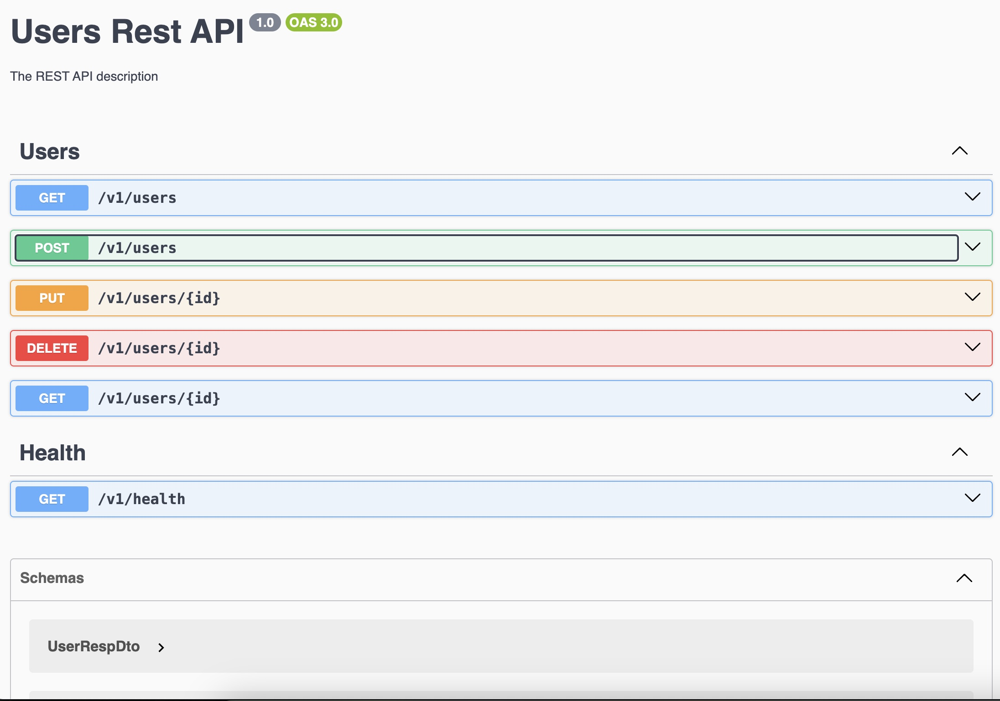

# magmamath

## Run app

Node.js v22 LTS

```
npm install
docker-compose build --no-cache
docker-compose up -d
```

Open Swagger Doc http://localhost:3000/api#/
Kafdrop http://localhost:9000/

## Directories explanation

The directory structure reflects the Domain Driven Design and Layered Architecture approach.

```
├── apps
│   ├── <application>
│     ├── app
│     └── domain
│
├── libs
└── test
```

`apps` - Applications - native NestJS Monorepo approach ([Monorepo mode](https://docs.nestjs.com/cli/monorepo#monorepo-mode))

`apps/<app-name>/app` - Application layer with use cases

`apps/<app-name>/domain` - Domain layer with entities & services

`libs` - Infrastructure layer & some shared code ([Native NestJS approach](https://docs.nestjs.com/cli/monorepo#libraries))



### Demo

[](https://www.youtube.com/watch?v=H6ra4Ft27o4)
